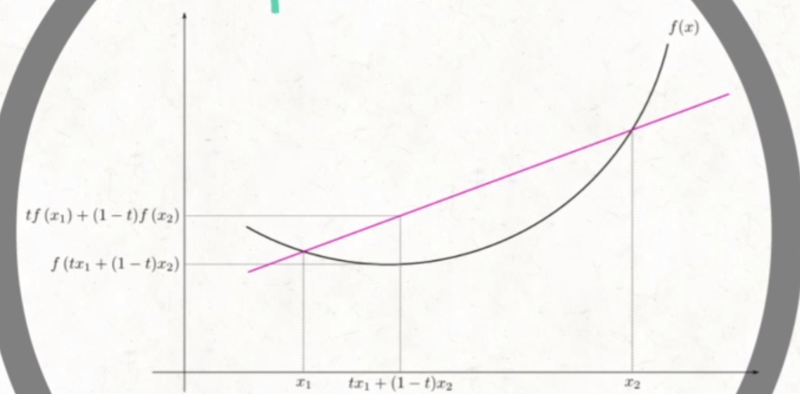
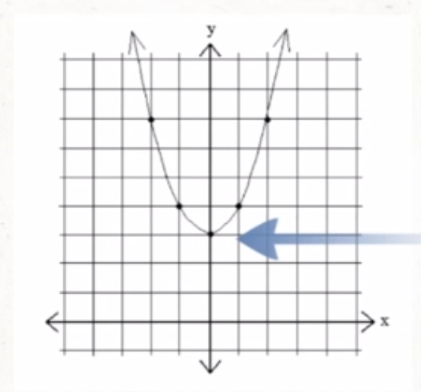

# Mathematical Foundations for ML and AI

## Linear Algebra
### Vector and Matrix Norms
**Norm**: function used to measure the magnitude of a 
- Norms map vectors to non-negative values
- The norm vector **x** measures the distance from the origin to the point **x**

**Norm Types**
- Lp 

- Eucledean Norm (L2 norm or ||**x**||): most commonly used norm function. 

- L1: used in cases where discriminating between small, nonzero values and zero is important. Increases linearly as elements of **x** increase. 

- Max Norm (Linf): simplifies to the absolute value of the largest element in the vector.  

- Frobenius Norm: Analogous to L2 norm for a vector used in matrices. 

### Vectors, Matrices, and Tensors in Python
See vector_matrices_tensors_in_python.ipynb file

### Special Matrices and Vectors
#### Diagonal Matrices
A matrix is diagonal if the following condition is met: 
</a>

Example of a diagonal matrix:  

- Multiplying by a diagonal matrix is computational efficient. For *diag(**v**)**x***, we only need to scale each element *xi* by *vi* 
- In some cases, computationally efficient algorithms are designed by restricting some matrices to be diagonal
- Diagonal matrices need not be square

#### Symmetric Matrices
Symmetric matrices are matrices equal to their transpose 
**A** = **A**T

For example: 

- Symmetric matrices often arise when the entries are generated by some function of two arguments that does not depend on the order of arguments. Eucledian distance is symmetric, so distance matrices will often be symmetric matrices.

#### Unit Vector
A unit vector is a vector with unit norm:  

A unit vector can be obtained by normalizing any vector.

##### Vector Normalization
Normalization is the process of diving a vector by its magnitude, which produces a unit vector. 

#### Orthogonality
A vector **x** and a vector **y** are **orthogonal** to each other if **x** \* **y** = 0

If two vectors are orthogonal and have a nonzero magnitude in a 2D space, they will be at a 90 degree angle to each other.

If two vector are orthogonal and unit vectors, they are **orthonormal**.

Orthogonal matrices are matrices whose rows and columns are mutually orthonormal. This is not commonly used in artificial intelligence.

### Eigenvalues and Eigenvectors
#### Eigendecomposition
Eigendecomposition is breaking mathematical objects into their constituent parts. For example: breaking up integer 10 into its prime factors: 2 and 5. We can conclude that 10 is not divisible by 3 and any product of 10 will also be divisible by 5 and 2.

We can also apply this to matrices to reveal functional properties that are not obvious from the representation of the matrix as an array of elements.

#### Eigenvectors and Eigenvalues
An eigenvector of a square matrix **A** is a nonzero vector **v** such that multiplication by **A** alters only the scale of **v**. 
 
where:
- **v** = eigenvector
-  = a scalar, the eigenvalue corresponding to **v**

#### Eigendecomposition
If a matrix **A** has *n* linearly independent eigenvectors we ca nform a matrix **V** with one eigenvector per columns, and a vector  of all the eigenvalues.

The eigendecomposition of **A** is given by: 

#### Inverse Matrix
 
where **I** is the identity matrix.

The identity matrix is a square matrix with 1 on the diagonal and 0 elsewhere. 

#### Eigendecomposition Properties
- Not every matrix can be decomposed into eigenvalues and eigenvectors.
- A matrix is singular (the inverse does not exist) if any of the eigenvalues are zero.
- A matrix with all positive eigenvalues is called a positive definite.
- A matrix with all positive or zero eigenvalues is positive semidefinite.
- A matrix with all negative eigenvalues is negative definite.
- A matrix with all negative or zero eigenvalues is negative semidefinite.

#### Application of Eigendecomposition
Eigenvalue decomposition is mainly used in principal component analysis (PCA).

PCA is a statistical procedured used to convert a set of observations of possibly correlated variables into a set of values of lineraly uncorrelated variables called principal components.

PCA is used for summarizing or compressing the data.

## Multivariate Calculus
### Introduction to Derivatives
**Definition** 
- From a geometric perspective it is the slope of a curve. How much does the line change at that point.
- From a physical concept it is the rate of change

#### Derivative basics
The derivative operator: 
where *d* implies derivative and the *x* indicates which variable will the derivative be taken of.

Different notations: 
If  then 

#### Derivative Rules
- Constant  
; for example

- Power rule 
; for example

- Multiplication 
; for example

- Sum rule 
; for example

- Product rule  
; for example

- Chain rule  
; for example

#### Partial Derivatives
Used for functions with more than one variable.

Example:

<table>
    <tr>
        <td>1.  and treat <i>y</i> as a constant</td>
        <td>2.  and treat <i>x</i> as a constant</td>
    </tr>
    <tr>
        <td>
             
             
             
             
            
        </td>
        <td>
             
             
             
            
        </td>
    </tr>
</table>

These are the partial derivatives with respect to other variable.

### Introduction to Integration
Integration is used to find the area under the curve. It is the reverse process of differentiation.

Where *C* is the constant of integration.

<table>
<caption>Types of Derivatives</caption>
    <tr>
        <th>Indefinite</th>
        <th>Definite</th>
    </tr>
    <tr>
        <td>
            Integrals with no limits 
            
        </td>
        <td>
            Integrals with limits 
            
        </td>
    </tr>
</table>

#### Integration Rules
- Power Rule 
; for example

- Constants 
; for example

#### Evaluating Definite Integrals
 
(value of  at *x* = *b*)-(value of  at *x*=*a*) 
 

For example:

 
 
 
 
 
So the area under the curve between *x*=0 and *x*=2 is 8.

### Vector Calculus: Gradients
Partial derivatives can be organised as vectors.

For example:

 

The gradient represents the rate of change. It points in the direction of the greates rate of increase of the function, and its magnitude is the slope in that direction.

Gradient vectors can be in *n* dimensions.

#### Jacobian Matrix
Matrix to organise multiple functions of partial derivatives

**The general case**

 where 

### Mathematical Optimisation
The optimisation problem:

Minimize *f*0(*x*) --> also known as the objective function where *x* is the optimisation variable. These are the parameters we want to update.

So that:

 

These are the constraint functions.

**Difference between local and global critical points** 
Critical points: maximum or minimum. Defined by the derivative of the slope = 0. 

There are global and local critical points. Global critical points are the absolute largest/lowest points in the graph. Local critical points are the largest/lowest points in their immediate area.

#### Convex Optimisation
If the objective function is convex, the optimisation problem is called convex optimisation. A convex function is such that when drawing a line between any two points of the function curve, all points in the curve are lower than any point in the line other than the origin and final points of the line.

#### Finding Extrema (Critical Points) with Calculus
Calculus can be used to find extrema for an objective function. For example:

The derivative at the critical point will be = 0.

1. Find the first derivative of the *f(x)* 
y=x2+3 
y'=2x

2. Set the derivative = 0
0=2x
x=0 --> this is a critical point

3. Do the second derivative test
y'=2x 
y''=2 --> if the second derivative is positive we have a minimum, if negative we have a maximum.

If we can prove that the function is a convex function, there is no need to do the second derivative test as we would be guaranteed to be at the global critical point.

In machine learning the optimisation process is iterative by starting with a guess and then iterating.

## Probability Theory
### Intro to Probability
- Sources of uncertainty
  - Inherent stochasticity in the system being modeled
  - Incoplete observability
  - Incomplete modelling
- Types of probability
  - Frequentist: the frequency of events.
  - Bayesian probability: a degree of belief
Both types of proabilities follow the same anxioms and are modelled the same.

### Probability Distributions
Random variables
- a variable that can take different values randomly
- a probability distribution specifies how likely each value is to occur
- may be discrete (finite or countable number of states) or continuous

#### Probability Distributio for Distcrete Variables
**Probability Mass Function**: Probability distribution for discrete random variables 
- Criteria for PMF:
  - the domain of *P* must be the set of all possible states of *x*
  - 
  -  --> the sumation over all possible states of *P(x)* = 1. This is known as being normalised.
  
**Joint Probability Distributions**: PMF that acts on multiple variables 
*P(x=x,y=y)* denotes the probability that *x=x* and *y=y* simultaneously.

**Uniform Distribution**: probability distribution where each state of the distribution is equally likely.This distribution is normalised. 
 

#### Probability Distribution for Continuous Variables
**Probability Density Function**: probability distributions for continuous variables.

To be a PDF, the function *p* must satisfy:
- The domain of *p* must be the set of all positive states of *x*

- 

- 

#### Marginal Probability
Probability distribution over a subset of all the variables.

**With discrete random variables** 
If we know *P(x,y)*, we can find *P(x)* with the sum rule: 

**With continuous random variables** 

#### Conditional Probability
The probability of some event given that some other event has happened. 

### Expectation, Variance, and Covariance
- Expectation: The expectation of some function *f(x)* with respect to some probability distribution *P(x)* is the mean value *f* takes on when *x* is drawn from *P*.
  - For discrete variables 
  - For continuous variables 
  
- Variance (): the expectation of the squared deviation of a random variable from its mean. It measures how far random numbers drawn from a probability distribution *P(x)* are spread out from their average value. 

- Standard Deviation(): 

- Covariance: a measure of how much two variables are related to each other. 

  - High absolute value - values are both far from their respective means at the same time.
  - Positive: both variables take on large values simultaneously.
  - Negative: variables take inversely large values.
  - Covariance is affected by scale
  - Covariance and dependence are related but distinct concepts. Two independent variables have zero covariance but it is possible for dependent variables to have zero covariance if their relationship is non-linear. Independence already excludes non-linear relationships.
  - Commonly used in AI to compress input data or produce better output results when input variables are identified as linearly dependent.

- Covariance Matrix: the covariance matrix of a random vector **x** is an *n* x *n* matrix such that: 

  - The diagonal elements of the covariance matrix give the variance: 